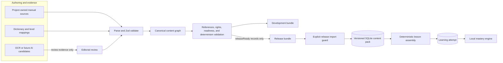
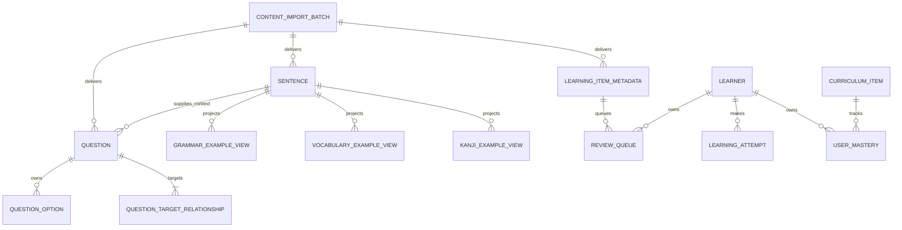
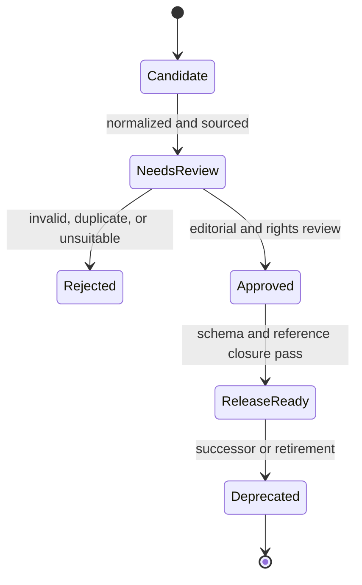
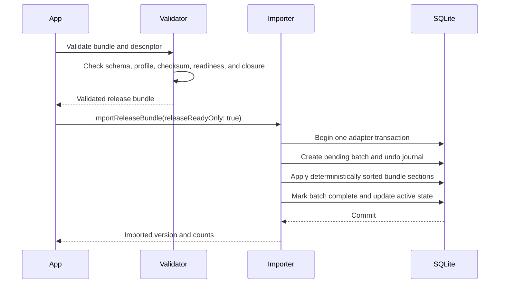
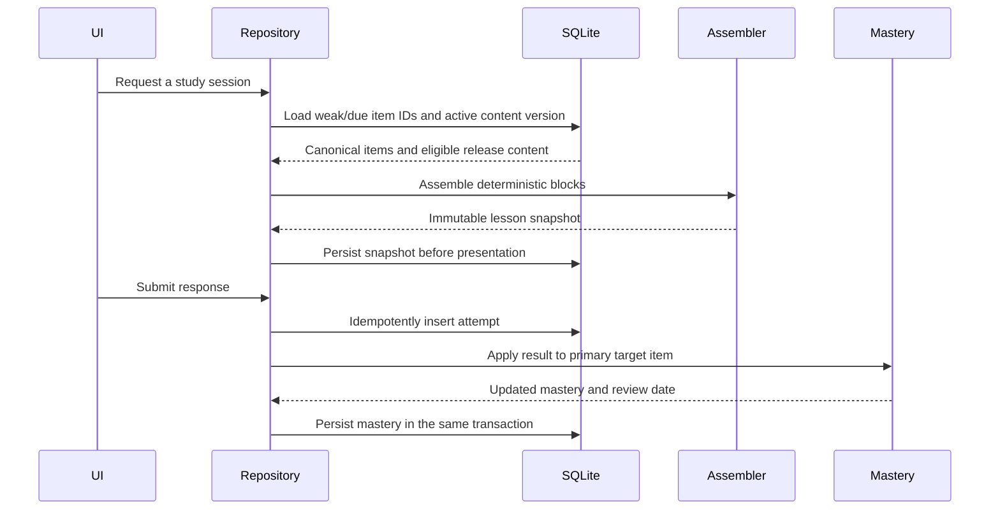

# Learning content architecture

Status: architecture and infrastructure contract

Last reviewed: 2026-07-26

Applies to: reusable sentence cores, reusable questions, static learning metadata, generated-content delivery, and local persistence

## Purpose and phase boundary

JapanGo needs reusable learning content without weakening the boundaries that already protect curriculum accuracy and learner progress. This document defines the next content layer and the infrastructure needed to validate, package, import, version, and persist it.

This phase is deliberately content-empty. It may implement:

- TypeScript domain types and Zod schemas;
- deterministic content-pipeline projections and validation;
- SQLite migrations and repositories;
- release/development bundle import infrastructure;
- identity-reconciliation infrastructure;
- synthetic fixtures and automated tests.

It does **not** add production sentences, questions, lesson content, copied textbook examples, AI-generated material, a lesson player, or new mastery behaviour. The current hand-authored assessment remains active until the identity and release gates in this document are satisfied.

## Non-negotiable principles

1. Canonical curriculum records own language identity, readings, meanings, and grammar classification.
2. Sentence and question records reference canonical items; they do not redefine them.
3. Learner state is separate from static content metadata.
4. OCR and future AI output are candidate evidence only. Neither may become release content without editorial review and normal validation.
5. The mobile app calculates mastery, weakness, review dates, and scheduling deterministically.
6. Production imports require a release-profile bundle and an explicit `releaseReadyOnly: true` call.
7. Content updates must preserve attempts, mastery, and resumable lessons.
8. Copyrighted textbooks may contribute limited book/lesson/page comparison metadata only. Their prose, examples, exercises, answers, and transcripts are not reusable content sources.
9. All content needed by a downloaded lesson must work offline.

## Current architecture

### Application

- Expo Router screens in `src/app` coordinate features and repositories.
- Domain types currently live in `src/types/learning.ts`.
- Feature-level Zod schemas validate curriculum seeds, assessment questions, attempts, mastery, and settings.
- Zustand stores a small in-memory session. SQLite remains persisted truth.
- `src/features/progress/mastery-engine.ts` implements deterministic mastery, weakness, and review scheduling.
- No account, backend, analytics service, AI provider, or remote sync is connected.

### SQLite version 1

The current `japango.db` migration creates:

| Table | Current responsibility | Important limitation |
| --- | --- | --- |
| `learner_profile` | Local learner and assessment result | One local profile; no sync identity yet |
| `curriculum_items` | Flattened app-facing item records | No content version, source hash, active state, or rich grammar metadata |
| `assessment_questions` | Materialized initial assessment | `position` is globally unique instead of scoped to an assessment form |
| `learning_attempts` | Idempotent answer history | One `item_id`; no question revision or content-pack version |
| `user_mastery` | Per-learner, per-item deterministic state | Depends on stable curriculum identity |
| `app_settings` | Validated local settings | Not content-specific |

Database startup currently loops through the hand-authored seed with `INSERT OR IGNORE`, initializes mastery rows, and leaves existing records unchanged.

### Generated-content pipeline

The Node/TypeScript pipeline in `scripts/content` produces rich canonical files, reports, a manifest, and two app-facing profiles:

- `assets/generated-content-compact/development/content.json`
- `assets/generated-content-compact/release/content.json`

The pure guard in `src/features/curriculum/generated-content-import.ts` prevents a development bundle from being selected in release mode. It intentionally performs no database writes.

The pre-infrastructure baseline inspected at the start of this phase used
manifest `1.2.0+ea7eb08e24fb` and reported:

| Content | Canonical total | Release-ready |
| --- | ---: | ---: |
| Vocabulary | 1,152 | 1,152 |
| Kanji | 245 | 223 |
| Grammar | 237 | 111 |
| Curriculum units | 80 | 0 |

The release compact bundle therefore contains 1,486 records and no curriculum units. The app does not import this bundle. It still seeds 44 hand-authored curriculum items and 20 assessment questions.

These numbers describe the current snapshot, not a permanent contract.

## Sources of truth

| Layer | Owns | Must not own |
| --- | --- | --- |
| Authoring sources | Original/manual content and provenance | Learner state |
| Canonical generated graph | Stable language identities and reviewed relationships | Runtime scheduling decisions |
| Delivery bundle | Validated projection for one profile and schema version | Unreviewed candidates |
| SQLite content pack | Active offline content and immutable revisions | Canonical source authoring |
| Attempts and mastery | Learner history and deterministic progress | Language definitions or content readiness |



## Identity and versioning

### Existing namespaces

| Entity | Current ID examples | Status |
| --- | --- | --- |
| Generated vocabulary | `vocab-学校-がっこう` | Intended canonical identity |
| Generated kanji | `kanji-学` | Intended canonical identity |
| Generated grammar | `grammar-desu`, `grammar-n4-nagara` | Canonical only when its record is release-ready |
| Hand-authored seed item | `n5-vocab-gakkou`, `n5-kanji-yama` | Transitional app identity |
| Curriculum unit | `n5-unit-001` | Development-only today |
| Assessment question | `assessment-vocab-01` | Hand-authored materialized question |
| Learner/attempt | `learner-*`, `attempt-*` | Client-created runtime identity |

There are zero exact ID matches between the 44 hand-authored seed items and the current release bundle. At least 20 records are obvious same-title semantic overlaps—10 vocabulary and all 10 kanji seed records—and further verb lemma/inflection and grammar overlaps require editorial reconciliation. Importing both namespaces as independent items would split mastery and create duplicate learning queues.

### New namespaces

- Sentence core: `sentence-<stable-editorial-key>`
- Grammar, vocabulary, and kanji views: `grammar-example-*`,
  `vocabulary-example-*`, and `kanji-example-*`
- Question definition and option: `question-*` and `question-option-*`
- Question target relationship: `question-target-*`
- Learning metadata record: `learning-item-*`
- Local review queue entry: `review-queue-*`
- Content pack: the source-derived manifest `contentVersion`

### ID rules

- IDs are opaque outside validation and must never be recycled.
- Array positions, database row IDs, timestamps, and source page numbers must not determine canonical IDs.
- A typo or metadata correction may retain semantic identity only under a
  documented compatible schema/content release. A changed learning objective,
  answer, grammatical meaning, or target identity requires a new ID or an
  explicitly reviewed successor.
- Question option IDs are globally namespaced and stable within their question.
- Runtime code must not infer level or pedagogy solely from an ID prefix.
- Deprecated identities remain resolvable for attempt history.

### Record and pack versions

The implemented reusable entity schemas carry `schemaVersion: 1`. The compact
envelope carries pipeline `schemaVersion`, source-derived `contentVersion`, and
a SHA-256 payload `checksum`. The SQLite import ledger retains all three values
with the profile. Record revisions, successors, and immutable lesson snapshots
remain future additions; they are not implied by `schemaVersion` and are not
implemented in this phase.

## Reusable sentence-core model

A sentence core is a reviewed linguistic context that can be reused by multiple questions and lessons. It is not a lesson block, a question, an audio file, or a copy of a textbook example.

Implemented `Sentence` contract:

```ts
interface Sentence {
  schemaVersion: 1;
  id: string;
  japanese: string;
  reading: string;
  english: string;
  register: "neutral" | "plain" | "polite" | "honorific" | "humble" | "mixed";
  difficulty: { jlptLevel: "N5" | "N4" | null; rank: 1 | 2 | 3 | 4 | 5 };
  tags: string[];
  context: {
    kind: "standalone" | "dialogue" | "narrative" | "notice" | "instruction";
    speaker: string | null;
    addressee: string | null;
    settingTags: string[];
  };
  curriculumUnitIds: string[];
  media: { audioAssetIds: string[]; imageAssetIds: string[] };
  sourceIds: string[];
  attribution: string[];
  confidence: number;
  needsReview: boolean;
  releaseReady: boolean;
}
```

Rules:

- `japanese`, `reading`, and `english` exist in one canonical record only.
- Grammar, vocabulary, and kanji relationships are normalized into
  `GrammarExampleView`, `VocabularyExampleView`, and `KanjiExampleView` records.
  A view stores `sentenceId`, one typed curriculum target ID, role, and Unicode
  code-point focus ranges; it contains no sentence text.
- Curriculum-unit membership stores IDs only. The SQLite migration normalizes
  these into `sentence_curriculum_relationships`.
- Tags and ID arrays are unique and lexically sorted.
- Translation is not displayed by default during normal reading practice.
- Source and attribution fields are mandatory. A textbook reference may
  confirm coverage but cannot be the sentence's prose source.
- Reading, token, furigana, and audio alignment may be added as reviewed revisions; they must not be guessed at import time.
- Future audio and images attach to the sentence by asset ID rather than
  copying the sentence into media entities.

Sentences are the reusable core because the same reviewed linguistic context
can serve a grammar view, vocabulary view, kanji view, prompt stimulus, answer
option, reading block, listening transcript, or later exam item. Each consumer
references the stable sentence ID. A correction therefore happens once, and
release/readiness validation can follow every consumer of that sentence.

## Reusable question model

A question definition is a fully materialized, reusable exercise. A future
question template is a generation recipe with unresolved slots. The two must
not share a schema or table.

Shared fields include:

```ts
interface QuestionBase {
  schemaVersion: 1;
  id: string;
  domain: "grammar" | "vocabulary" | "kanji" | "reading" | "listening";
  presentation:
    | "multiple-choice"
    | "choose-reading"
    | "fill-blank"
    | "sentence-order"
    | "short-answer";
  prompt: { text: string; language: "ja" | "en" | "bilingual" };
  stimulusReferences: Array<
    | { type: "sentence"; id: string }
    | { type: "reading-passage" | "audio" | "image"; id: string }
  >;
  explanation: string | null;
  difficulty: { jlptLevel: "N5" | "N4" | null; rank: number };
  examMetadata: {
    jlptLevel: "N5" | "N4";
    section: "grammar" | "vocabulary" | "kanji" | "reading" | "listening";
    formatCode: string;
    recommendedSeconds: number | null;
  } | null;
  usageContexts: Array<"lesson" | "review" | "assessment" | "mock-exam">;
  tags: string[];
  sourceIds: string[];
  attribution: string[];
  confidence: number;
  needsReview: boolean;
  releaseReady: boolean;
}
```

The implemented question contract discriminates on `responseType`:

- `single-select`: exactly one correct option ID;
- `multiple-select`: two or more sorted, unique correct option IDs;
- `ordering`: two or more option IDs in correct order;
- `text-input`: accepted answers plus explicit normalization flags.

`QuestionOption` owns its stable position and either text or a sentence/audio/
image reference. It never repeats a referenced sentence. Correctness has one
authority on `Question`; options do not also carry `isCorrect`.

`QuestionTargetRelationship` links a question to grammar, vocabulary, kanji,
or a sentence with `primary`, `supporting`, or `distractor-source` role and an
assessed skill. Every question requires a primary target. The existing
assessment types adapt as follows:

| Existing type | Reusable definition |
| --- | --- |
| `multiple-choice` | `choice` |
| `choose-reading` | `choice` with a reading skill tag |
| `fill-blank` | `cloze` or `choice`, depending on whether answers are free-form |
| `short-reading` | `reading-comprehension` |

The schema allows multiple relationships for future analysis, but the runtime
mastery policy remains one primary scored item per attempt. Supporting and
distractor-source relationships must not silently update mastery. Future JLPT
forms use `usageContexts: ["mock-exam"]` and `examMetadata`, avoiding another
question schema.

## Static learning metadata

Learning metadata describes how a canonical item may be taught. It does not describe how a particular learner is performing.

```ts
interface LearningItemMetadata {
  schemaVersion: 1;
  id: string;
  itemType: "grammar" | "vocabulary" | "kanji" | "sentence" | "question";
  itemId: string;
  reviewable: boolean;
  skills: string[];
  availableModes: Array<"reading" | "listening" | "quiz" | "assessment">;
  estimatedReviewSeconds: number | null;
  tags: string[];
  confidence: number;
  needsReview: boolean;
  releaseReady: boolean;
}
```

It must not contain mastery scores, response times, attempt counts, learner
weaknesses, next-review dates, intervals, ease factors, or AI-selected weights.
Those remain in the deterministic learning engine and user tables.

`ReviewQueue` is a separate versioned local-user entity. It references a
`LearningItemMetadata` ID and stores reason, status, stable position, optional
source attempt, and timestamps. `availableAt` is only a place for a future
scheduler result; this phase never computes it. Review queues are never emitted
in canonical or compact generated content.

## Domain relationships



## Readiness model

Release readiness is a validated result, not an editorial shortcut:

```text
releaseReady =
  schemaValid
  AND editoriallyApproved
  AND needsReview = false
  AND confidence >= required threshold
  AND referencesResolve
  AND linkedReleaseRecordsAreReady
  AND rightsStatus is publishable
  AND no OCR-only or AI-only canonical fields exist
```



A development bundle may retain `NeedsReview` records. A release bundle may contain only `ReleaseReady` records and must have complete reference closure.

## Delivery bundle contract

The existing compact `records` projection is sufficient for curriculum cards
but too lossy for reusable questions and sentence validation. Pipeline 1.3.0
therefore adds an explicit, currently empty `learningContent` section:

```ts
interface CompactContentBundle {
  schemaVersion: string;
  contentVersion: string;
  checksum: `sha256:${string}`;
  profile: "development" | "release";
  releaseReadyOnly: boolean;
  records: CompactCurriculumItem[];
  curriculumUnits: CurriculumUnit[];
  learningContent: {
    schemaVersion: 1;
    sentences: Sentence[];
    grammarExampleViews: GrammarExampleView[];
    vocabularyExampleViews: VocabularyExampleView[];
    kanjiExampleViews: KanjiExampleView[];
    questions: Question[];
    questionOptions: QuestionOption[];
    learningItemMetadata: LearningItemMetadata[];
    questionTargetRelationships: QuestionTargetRelationship[];
  };
  counts: { /* current and learning-content section counts */ };
}
```

Every collection is deterministically sorted. Development retains reviewed and
review-needed records; release retains only release-ready records after bundle
validation proves complete reference closure. The payload checksum is computed
before the checksum field is attached, avoiding self-reference. The manifest
still records the checksum of the serialized compact file.

## SQLite migration architecture

### Version 2 tables

Database migration 2 adds these tables and views without inserting a sentence,
question, metadata record, or review entry:

| Table | Purpose |
| --- | --- |
| `content_import_batches` | Schema/content/checksum/profile identity and lifecycle |
| `content_import_state` | Active and previous batch per profile |
| `content_import_changes` | Ordered before/after undo journal for explicit rollback |
| `curriculum_units` | Future imported unit projection; empty in this phase |
| `sentences`, `sentence_tags` | Canonical sentence payload and normalized tags |
| `sentence_*_relationships` | Grammar, vocabulary, kanji, and curriculum joins |
| `questions`, `question_options` | Shared discriminated question data and stable options |
| `question_target_relationships` | Typed scoring/evidence targets |
| `learning_item_metadata` | Static, generic learning capabilities |
| `review_queue` | Local future review work; no scheduler is implemented |
| `*_example_view` | SQL joins that project sentence text without storing a copy |

JSON columns are used for validated nested fields such as context, media,
focus ranges, prompt, answer normalization, and metadata. High-value entity
relationships remain normalized.

### Later runtime tables

`content_id_aliases`, immutable record revisions, `lesson_snapshots`, lesson
blocks, media registries, download state, and sync queues belong to later
identity/lesson/offline phases. They are intentionally not created here.

### Migration guarantees

- Upgrade from database version 1 in a transaction.
- Never drop or rewrite learner attempts or mastery without an approved identity map.
- The persistence adapter must keep the previous content pack active until the
  new pack passes every check.
- Learner attempts and mastery remain untouched by this migration.
- A repeated import of the same content version and checksum is an idempotent no-op.
- A failed adapter transaction rolls back. A completed batch may be reversed
  through its undo journal; repeated rollback is also idempotent.

## Import sequence



Required ordering:

1. Validate schema/content/checksum/profile metadata and the supported schema list.
2. Require release profile plus `releaseReadyOnly: true` for production, or an
   explicit development opt-in.
3. Filter by profile, reject duplicate IDs, and sort every section by stable ID.
4. Find a completed batch with the same profile/schema/content identity.
5. Return `already-imported` when its checksum and readiness mode match; reject
   checksum drift for the same content identity.
6. In one adapter transaction, begin a pending batch, apply the whole bundle,
   and complete the batch.
7. On any error, let the adapter transaction restore its prior state.
8. For explicit rollback, restore the batch undo journal and mark it rolled back
   in one transaction.

The importer defines this transactional store boundary and is covered with a
stateful test adapter. It is deliberately not wired to app startup and no
generated content is imported in this phase. A concrete SQLite row mapper must
remain blocked on the Phase 2 identity gate.

The current per-row startup seed loop is not the production importer. A full pack requires prepared statements or bounded batches and performance measurement on a physical Android device.

## Runtime selection and mastery attribution



Sentence and question metadata may constrain eligibility, but they do not choose weak items or assign mastery. The lesson selector starts from weak, due, new, or review item IDs produced by deterministic application logic.

## Phase 2 identity-reconciliation gate

The import infrastructure must remain disabled for production content until the hand-authored seed and generated identities are reconciled.

The gate requires a checked-in, validated decision for every current seed item:

- `same-canonical`: replace the seed ID with an existing generated ID;
- `form-variant`: map an inflected seed form to a canonical lemma with explicit presentation metadata;
- `seed-only`: retain a project-owned canonical item absent from generated data;
- `retire-and-remap`: migrate progress to a reviewed successor;
- `unresolved`: block production import.

Before the gate opens:

- every seed ID has exactly one decision;
- every alias target exists and is release-ready or explicitly project-owned;
- aliases are acyclic and many-to-one merges are intentional;
- existing `user_mastery.item_id`, `learning_attempts.item_id`, and assessment references have a transactional migration plan;
- colliding mastery histories have a deterministic merge rule;
- seed-only reading/kana items retain a canonical source and release policy;
- generated N5 grammar that remains development-only does not silently replace reviewed seed grammar;
- migration is covered from a populated version-1 database;
- rollback preserves the original learner state.

Until then, the app continues to use its existing seed and the generated importer may be exercised only with synthetic fixtures or explicit development data.

## Validation rules

### All records

- Required fields exist and unknown fields are rejected at authoring boundaries.
- IDs are stable, correctly prefixed, and globally unique.
- Confidence is within `[0, 1]`.
- Readiness flags and review state are consistent.
- Sentence/question source references exist and attribution is nonempty.
- Deterministic sort keys are enforced.
- Release records contain no raw OCR, private prompt, or candidate-only fields.
- Release references resolve to release-ready records in the same pack or an explicitly compatible active pack.

### Sentences

- Japanese text is nonempty and valid Unicode.
- Normalization is deterministic and does not overwrite editorial text.
- At least one curriculum-unit membership or example-view relationship exists.
- Example-view roles and code-point focus ranges are valid.
- Reading and translation are stored once on the sentence and are editorially reviewed.
- Audio/image IDs are rejected until their registries exist.

### Questions

- Exactly one primary target exists.
- Every sentence reference resolves.
- Every option ID is unique and option positions are contiguous per question.
- Single-select questions contain exactly one valid correct option.
- Multiple-select and ordering answer IDs belong to the same question.
- Text-input questions contain accepted answers and explicit normalization rules.
- The answer and explanation do not contradict canonical item data.
- Question modes and type are compatible with the target's learning metadata.

### Learning metadata

- The canonical item exists.
- Typed grammar, vocabulary, kanji, sentence, and question targets resolve.
- Skills, modes, and tags are duplicate-free and deterministically sorted.
- No learner-specific state appears in static metadata.
- Release metadata references only release-ready capabilities.

### Packs and imports

- Schema and content versions are supported.
- Build-time manifest checksums and section counts match.
- Release bundles contain only release-ready records.
- IDs do not conflict across entity namespaces.
- Aliases resolve to one active canonical identity.
- Imports are deterministic, transactional, idempotent, and rollback-safe.

## Determinism contract

- Source records use stable IDs; no IDs derive from array indexes or runtime timestamps.
- Records sort by documented numeric/order fields and then stable IDs.
- Set/map output is explicitly sorted before serialization.
- JSON serialization is stable and newline-terminated.
- `SOURCE_DATE_EPOCH` or `JAPANGO_GENERATED_AT` controls the manifest timestamp.
- Content hashes exclude machine paths and uncontrolled clocks.
- Two fixed-timestamp builds from identical sources produce identical canonical and delivery digests.
- Reimporting the same content version and checksum produces no data changes.

## Testing strategy

Synthetic fixtures may exercise infrastructure; they must not be shipped as production learning content.

### Contract tests

- Empty canonical collections and representative sentence/question structures parse.
- Missing fields, unknown fields, invalid readiness, and invalid rights fail.
- Stable IDs and deterministic content-version/checksum generation are tested.
- Same semantic input in different source order produces identical output.

### Reference tests

- Missing item, sentence, question, source, alias, and revision references fail.
- Sentence/question link roles and one-primary-target rules are enforced.
- Duplicate identities and prerequisite cycles fail.
- Release reference closure is enforced.

### SQLite tests

- Version 0 applies versions 1 and 2 sequentially; version 1 applies only version 2.
- Version 2 is schema-only and contains no inserts.
- Current databases are no-ops; newer unsupported databases are rejected.
- A failed migration leaves the prior `user_version` intact.
- The same pack can be imported twice without duplicate rows or mastery updates.
- Failure after each import stage rolls back to the prior active pack.

### Integration tests

- Development bundles require explicit opt-in.
- Production rejects a development or malformed bundle.
- Checksum/count mismatch prevents writes.
- A new item creates one mastery row; a revised item does not reset mastery.
- A recorded question revision remains readable after a later revision is activated.
- Offline startup works from the active pack.

### Manual implementation checks

- Upgrade and import on a physical Android device.
- Startup and import time for the full release pack.
- Low-memory behaviour and interrupted import recovery.
- Small-screen and screen-reader rendering once a lesson UI exists.

## Risks and conflicts

| Priority | Risk | Required mitigation |
| --- | --- | --- |
| P0 | Seed and generated records use different IDs for overlapping concepts | Block production import behind the Phase 2 identity ledger and migration |
| P0 | No approved reusable sentence corpus currently exists | Require project-owned/manual or explicitly licensed sentence sources |
| P0 | Current import guard does not validate the complete runtime bundle | Add versioned Zod bundle parsing, checksum/count verification, and reference closure |
| P0 | A question can expose several items while mastery accepts one | Require one primary target; treat other links as non-scoring evidence |
| P1 | `INSERT OR IGNORE` cannot deliver corrections or deprecations | Replace startup seeding with versioned transactional import/upsert semantics |
| P1 | Current attempts do not retain question revision/content version | Add nullable audit columns before reusable questions are activated |
| P1 | Assessment question positions are globally unique | Introduce assessment forms and scoped membership positions |
| P1 | Compact records discard rich grammar/vocabulary/kanji metadata | Add versioned sentence/question/metadata sections and use canonical data for validation |
| P1 | The current release has zero curriculum units | Do not claim production sequencing until reviewed units pass release closure |
| P1 | Pipeline and app schemas can drift | Share a platform-neutral delivery contract or test both sides against identical fixtures |
| P1 | No database migration/repository integration tests currently exist | Add populated-v1 migration, import idempotency, and rollback coverage |
| P2 | Per-row import may be slow for thousands of linked records | Use prepared/bounded batches and measure on Android |
| P2 | Editing question text could change historical attempt meaning | Use immutable revisions and store revision/content-pack references |

## Infrastructure-phase definition of done

The architecture/infrastructure phase is complete when:

- this document and its terminology are accepted;
- versioned Zod schemas exist for sentence cores, question unions, example
  views, targets, learning metadata, local review queues, and their empty
  canonical collection envelope;
- database migrations create the phase tables without populating production learning content;
- a release/development importer contract verifies supported versions, checksum
  metadata, readiness/profile policy, deterministic ordering, and applies the
  whole validated bundle through one adapter transaction;
- a development import still requires explicit opt-in;
- migrations are additive from version 1 and leave all existing tables untouched;
- import is idempotent and rollback-safe;
- readiness, reference closure, source attribution, and deterministic ordering are tested;
- fixed-timestamp output digests are repeatable;
- the production generated-content import remains disabled until the Phase 2 identity gate passes;
- no production sentences, reusable questions, lesson blocks, or AI content are introduced by the infrastructure change.

After those conditions hold, content curation can proceed as a separate, reviewable phase using the same contracts.
